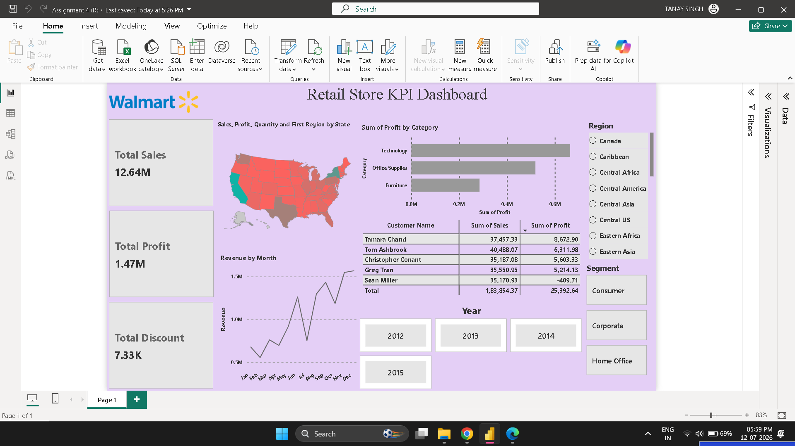

# 📊 Global Sales Dashboard | Power BI

An interactive Power BI dashboard built using the **Global Superstore 2016** dataset to analyze sales performance, profitability, customer behavior, and regional trends through dynamic visualizations and KPIs.

---

## 📌 Project Overview

This project presents a business intelligence dashboard developed in **Microsoft Power BI**. The dashboard enables users to explore sales data through interactive visuals, filters, and KPIs, helping identify trends and make data-driven decisions.

---

## ✨ Dashboard Features

- 🌍 Sales by Region (Shape Map)
- 📊 Category-wise Profit Analysis
- 📈 Monthly Revenue Trend
- 👥 Top 5 Customers
- 💰 KPI Cards
  - Total Sales
  - Total Profit
  - Total Discount
- 🎛 Interactive Slicers
  - Year
  - Region
  - Segment

---

## 🛠 Tools & Technologies

- Microsoft Power BI
- Power Query
- DAX (Data Analysis Expressions)
- Microsoft Excel
- Data Modeling

---

## 📂 Dataset

**Global Superstore 2016 Dataset**

The dataset contains information related to:
- Sales
- Profit
- Discount
- Customer Details
- Product Categories
- Regional Performance
- Order History

---

## 📸 Dashboard Preview

> *(Upload your dashboard screenshot as `dashboard.png` in the repository root.)*



---

## 🌐 Live Power BI Report

**View the Interactive Dashboard Here:**

🔗 **https://app.powerbi.com/groups/me/reports/129fd902-dbc6-40af-9080-087b17e779c8/969ab4eb8085b3752162?experience=power-bi**

---

## 📁 Repository Structure

```text
Global-Sales-Dashboard-PowerBI
│
├── Dataset/
│   └── global_superstore_2016 (1).xlsx
│
├── Assignment 4 (R).pbix
│
├── Global_superstore_dashboard.png
│
└── README.md
```

---

## 📈 Key Insights

- Analyze sales performance across different regions.
- Compare profitability across product categories.
- Track monthly revenue trends.
- Identify top-performing customers.
- Explore data dynamically using interactive filters.

---

## 🎯 Skills Demonstrated

- Data Cleaning & Transformation
- Data Modeling
- DAX Measures
- Interactive Dashboard Design
- Business Intelligence
- Data Visualization

---

## 👨‍💻 Author

**Reansh Singh**

Passionate about Data Analytics, Business Intelligence, and creating interactive dashboards using Power BI.

---

⭐ If you found this project useful, consider giving it a star!
